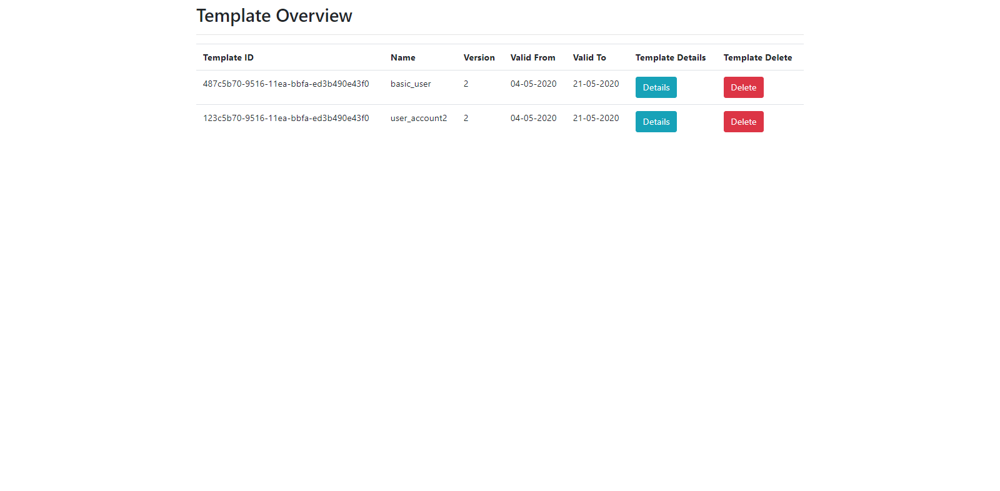

`Here are the templates Overview and details page`

# Technologies I have used

React js, redux, redux-saga, axios and jest enzyme for testing.

To run this app, First install `node_modules` inside project directory by

### `yarn install`

Then run the app by following command

### `yarn start`

It will start on port 3000

Then Run the test by

### `yarn test`

Please see the `screenshot` to see the view

